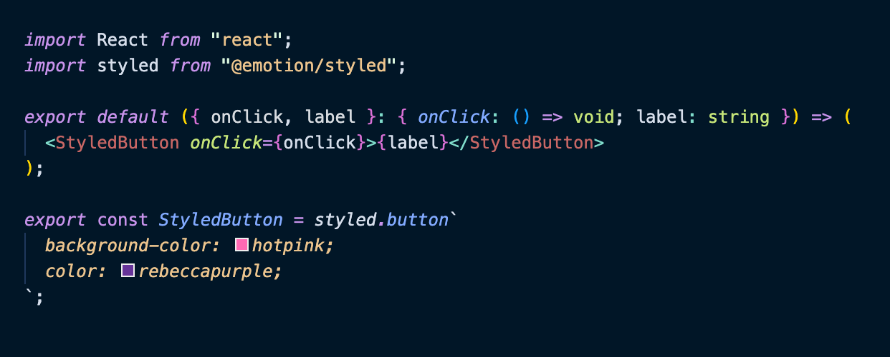

# Emotion Styled Component Highlighter

A Visual Studio Code extension that provides intelligent syntax highlighting for Emotion styled components in TypeScript/JavaScript projects.

## Quickly see what components are styled components



## Pick out the styled components even through imports


## 🚀 Features

- **Highlights emotion styled components** in JSX/TSX files with customizable colors
- **AST-based detection** for locally declared styled components
- **Supports multiple syntaxes**: template literals, object syntax, and function calls
- **Works with styled-components library** as well as @emotion/styled
- **Automatic theme-aware colors** with fallback support
- **Performance optimized** with smart caching and early exit strategies
- **Real-time updates** as you type and edit files

## 📦 Installation

### Manual Installation (Recommended)

1. **Clone the repository**:
```bash
git clone https://github.com/emotion-highlighter/emotion-styled-highlighter.git
cd emotion-styled-highlighter
```

2. **Install dependencies**:
```bash
yarn install
```

3. **Build the extension**:
```bash
yarn compile
```

4. **Package and install**:
```bash
yarn fullInstall
```

This will create a `.vsix` file and automatically install it in VS Code.

### Alternative Installation

If you prefer to do it step by step:

1. **Package the extension**:
```bash
yarn vsce package --dependencies
```

2. **Install the packaged extension**:
```bash
code --install-extension emotion-styled-highlighter-0.1.0.vsix
```

## ⚙️ Configuration

The extension uses a single, flexible configuration setting:

```json
{
  "editor.styledComponentHighlighting.enabled": true
}
```

### Configuration Options

| Value | Description |
|-------|-------------|
| `true` | Enable with automatic theme-aware colors (default) |
| `false` | Disable highlighting completely |
| `"#FF69B4"` | Enable with custom hex color |
| `"#RGB"` | Enable with custom short hex color |

### Examples

```json
{
  "editor.styledComponentHighlighting.enabled": true,           // Auto theme colors
  "editor.styledComponentHighlighting.enabled": false,          // Disabled
  "editor.styledComponentHighlighting.enabled": "#FF6B6B",     // Custom red
  "editor.styledComponentHighlighting.enabled": "#61DAFB"      // Custom blue
}
```

## 🎯 Supported Patterns

### Template Literal Syntax
```typescript
import styled from '@emotion/styled';

const Button = styled.button`
  background: blue;
  color: white;
`;
```

### Object Syntax
```typescript
const Container = styled.div({
  padding: '20px',
  margin: '10px'
});
```

### Function Call Syntax
```typescript
const Input = styled('input')`
  border: 1px solid gray;
`;
```

### Component Extension
```typescript
const PrimaryButton = styled(Button)`
  background: darkblue;
`;
```

### JSX Usage
```typescript
export default function App() {
  return (
    <div>
      <Button>Styled Button</Button>    {/* ✅ Highlighted */}
      <Container>Content</Container>    {/* ✅ Highlighted */}
      <button>Regular Button</button>   {/* ❌ Not highlighted */}
    </div>
  );
}
```

## 🔧 Commands

Access these commands via the Command Palette (Ctrl/Cmd+Shift+P):

- **`Emotion Highlighter: Clear Cache`** - Clear the analysis cache for better performance
- **`Emotion Highlighter: Toggle Styled Component Highlighting`** - Toggle highlighting on/off

## 📊 Status Bar

The status bar shows cache information:
- **`$(symbol-color) Emotion (X/Y)`** - X = analysis cache entries, Y = type cache entries
- **`$(symbol-color) Emotion (disabled)`** - Extension is disabled

Click the status bar item to clear the cache.

## 🧪 Testing

### Quick Test

1. **Create a test file** (e.g., `test.tsx`):
```typescript
import styled from '@emotion/styled';

const TestButton = styled.button`
  background: blue;
  color: white;
`;

export default function TestComponent() {
  return (
    <div>
      <TestButton>This should be highlighted</TestButton>
      <button>This should NOT be highlighted</button>
    </div>
  );
}
```

2. **Verify**: The `<TestButton>` should be highlighted in a different color, while `<button>` should appear normal.

### Development Testing

To test the extension in development mode:

```bash
git clone https://github.com/emotion-highlighter/emotion-styled-highlighter.git
cd emotion-styled-highlighter
yarn install
yarn compile
code .
# Press F5 to launch Extension Development Host
```

### Run Tests

```bash
yarn test
```

## 🚀 Performance

- **Smart caching**: Analysis results are cached for 30 seconds
- **Early exit**: Skips files without JSX elements or emotion imports
- **Incremental updates**: Only re-analyzes changed files
- **Optimized parsing**: Uses efficient AST traversal

## 🐛 Troubleshooting

### Common Issues

**Styled components not highlighted?**
1. Check that your file imports emotion: `import styled from '@emotion/styled'`
2. Verify the extension is enabled: `"editor.styledComponentHighlighting.enabled": true`
3. Try running the "Clear Cache" command
4. Ensure your file is a `.tsx` or `.jsx` file

**Performance issues?**
1. Use the "Clear Cache" command to reset the analysis cache
2. Check the status bar for cache statistics
3. Restart VS Code if issues persist

**Color not matching your theme?**
1. The extension automatically picks colors from your current theme
2. You can override with a custom color: `"editor.styledComponentHighlighting.enabled": "#your-color"`

## 🤝 Contributing

1. Fork the repository
2. Create a feature branch: `git checkout -b feature/amazing-feature`
3. Make your changes
4. Add tests for new functionality
5. Run tests: `yarn test`
6. Build: `yarn compile`
7. Submit a pull request

### Development Setup
```bash
git clone <your-fork>
cd emotion-styled-highlighter
yarn install
yarn compile
code .
# Press F5 to launch Extension Development Host
```

## 📚 Related Documentation

- **[Changelog](./CHANGELOG.md)** - Version history and changes
- **[Implementation Details](./IMPLEMENTATION_PLAN.md)** - Technical implementation overview
- **[License](./LICENSE.txt)** - MIT License details

## 🛠️ Technical Details

- **Languages**: TypeScript, JavaScript, TSX, JSX
- **VS Code API**: Semantic tokens, text editor decorations
- **Parser**: TypeScript AST with custom analysis
- **Performance**: Caching, early exit, incremental parsing
- **Testing**: Jest with VS Code API mocking

## 📄 License

MIT

## 🙏 Acknowledgments

- Built with VS Code's powerful extension API
- Inspired by the Emotion and styled-components communities

---

**🎨 Beautiful styled component highlighting for your Emotion and styled-components projects!**
