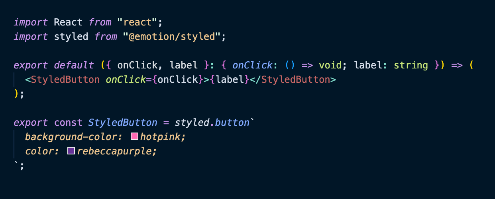
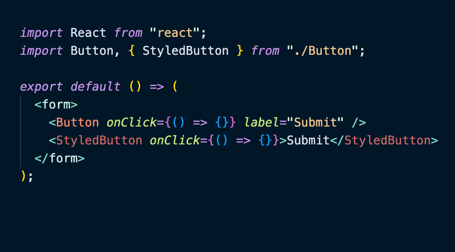

# Emotion Styled Component Highlighter

A Visual Studio Code extension that provides intelligent syntax highlighting for Emotion styled components in TypeScript/JavaScript projects.

## Quickly see what components are styled components



## Pick out the styled components even through imports



## 🚀 Features

- **Highlights emotion styled components** in JSX/TSX files with customizable colors
- **AST-based detection** for locally declared styled components
- **Supports multiple syntaxes**: template literals, object syntax, and function calls
- **Works with styled-components library** as well as @emotion/styled
- **Automatic theme-aware colors** with fallback support
- **Performance optimized** with smart caching and early exit strategies

## 📦 Installation

### From VSIX file

```bash
# If you have the .vsix file
code --install-extension emotion-styled-highlighter-0.1.0.vsix
```

### From source

```bash
git clone https://github.com/emotion-highlighter/emotion-styled-highlighter.git
cd emotion-styled-highlighter
yarn install
yarn compile
yarn fullInstall  # Packages and installs the extension
```

## ⚙️ Configuration

The extension uses a single configuration setting:

```json
{
  "editor.styledComponentHighlighting.enabled": true
}
```

### Configuration Options

| Value | Description |
|-------|-------------|
| `true` | Enable with automatic theme-aware colors (default) |
| `false` | Disable highlighting |
| `"#FF69B4"` | Enable with custom hex color |

## 🎯 Supported Patterns

```typescript
import styled from '@emotion/styled';

// Template literal
const Button = styled.button`
  background: blue;
`;

// Object syntax
const Container = styled.div({
  padding: '20px'
});

// Function call
const Input = styled('input')`
  border: 1px solid gray;
`;

// Component extension
const PrimaryButton = styled(Button)`
  background: darkblue;
`;
```

## 🔧 Commands

Access via Command Palette (Ctrl/Cmd+Shift+P):

- **`Emotion Highlighter: Clear Cache`** - Clear the analysis cache
- **`Emotion Highlighter: Toggle Styled Component Highlighting`** - Toggle highlighting on/off

## 🐛 Troubleshooting

**Styled components not highlighted?**
1. Check that your file imports emotion: `import styled from '@emotion/styled'`
2. Verify the extension is enabled
3. Try running the "Clear Cache" command
4. Ensure your file is a `.tsx` or `.jsx` file

**Performance issues?**
- Use the "Clear Cache" command
- Check the status bar for cache statistics
- Restart VS Code if issues persist

## 🤝 Contributing

1. Fork the repository
2. Create a feature branch
3. Make your changes
4. Run tests: `yarn test`
5. Submit a pull request

## 📄 License

MIT

---

**🎨 Beautiful styled component highlighting for your Emotion projects!**
